# IELTS Writing Lab

## Language

**English** | [Deutsch](README.de.md) | [Tiếng Việt](README.vi.md)

An AI-assisted, local-first IELTS Academic practice workspace for Writing, Reading, Listening, Speaking, Vocabulary, and progress tracking.

The app runs in the browser and supports either cloud AI providers or a project-local Ollama model. It is built for personal study and is not affiliated with IELTS, Cambridge University Press & Assessment, or the British Council.

> All screenshots below use anonymous demo data. Personal study records, API keys, local databases, model files, and runtime environments are excluded from the public project.
> **Mention**: Link demo does not have backend, you have to download to use the Speaking feature.
> Demo: https://william-rowan-waltor.github.io/NMT-Ielts-Studium/

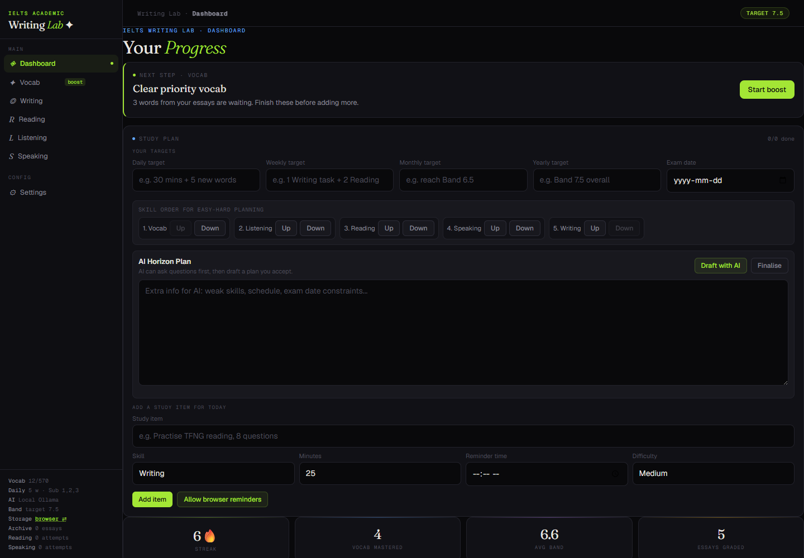

## Feature Tour

### Writing

Practice Task 1, Task 2, or a timed full Writing test. The workspace combines question generation, planning notes, focused micro-drills, essay drafting, AI grading, model answers, sentence-level feedback, rewrite training, calibration examples, and an error archive.

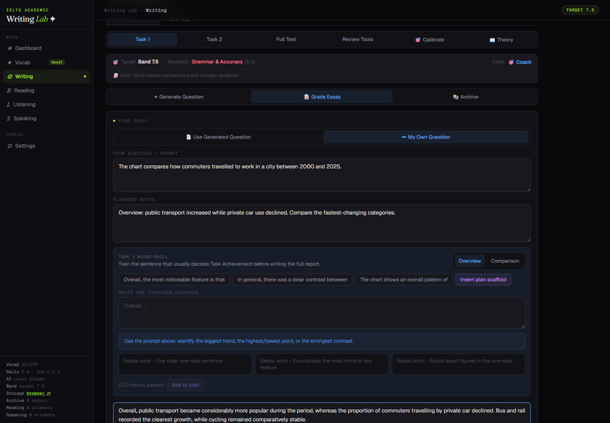

### Reading

Generate mini drills, single sections, or complete tests through a multi-step pipeline. Reading practice supports multiple question types, strict answer checking, source question numbers, notes, flags, highlighting, timers, and review analytics.

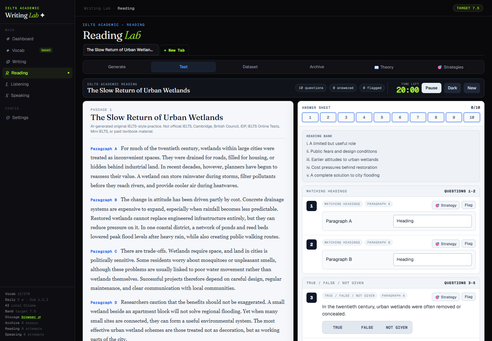

The generator can use optional factual grounding and selected dataset entries as few-shot style references.

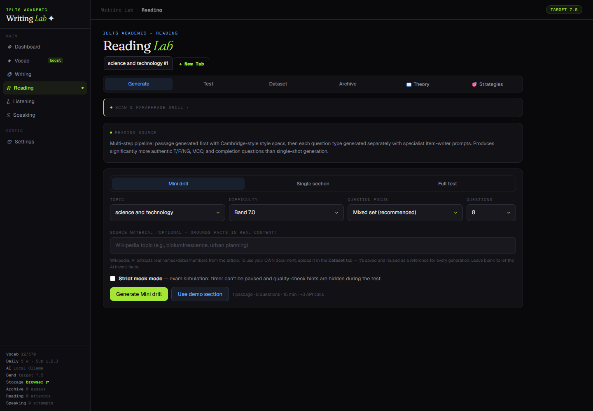

Uploaded Reading documents are processed as complete tests: the AI is instructed to preserve every detected passage, instruction, question, option, number, and original order.

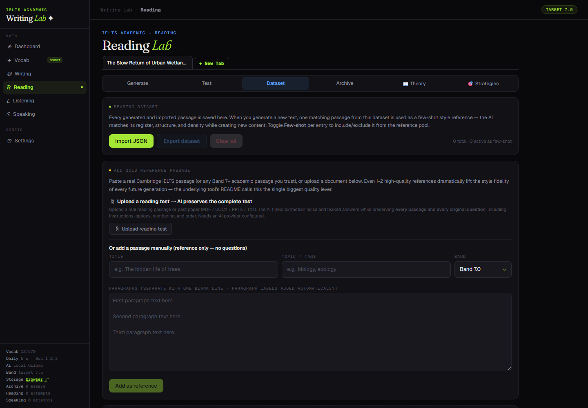

Animated strategy lessons cover question types and core sub-skills without revealing test answers before submission.

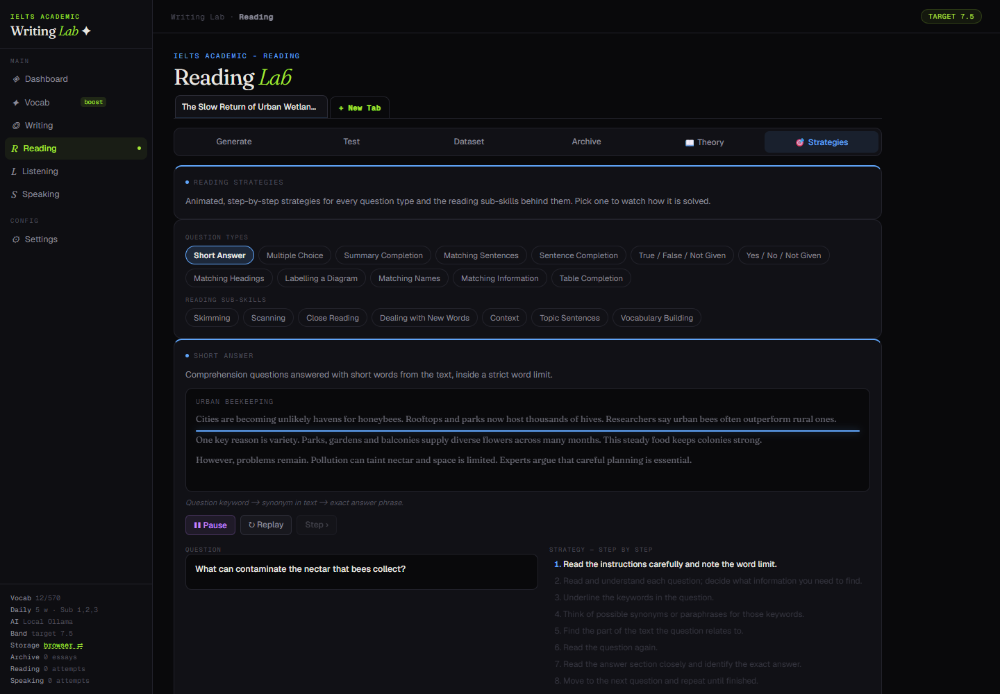

### Listening

Create IELTS-style Listening parts, import source material, build a local library, practise with transcripts, and review answers. Optional Supertonic support through the Speaking backend can generate distinct local voices for suitable dialogue.

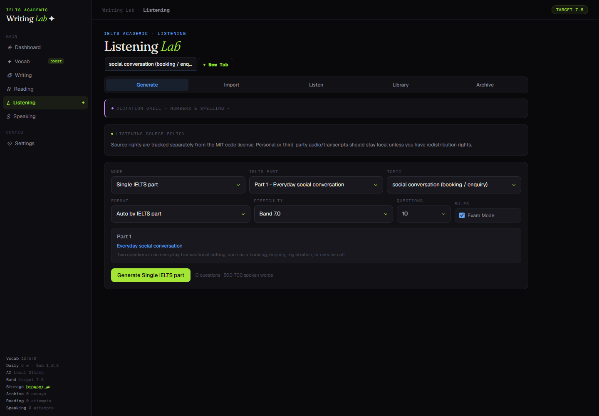

### Speaking

Use offline warm-ups and minimal-pair drills without a backend. With the optional local FastAPI backend, the app provides question libraries, local Whisper transcription, acoustic analysis, examiner scoring, and saved attempt history.

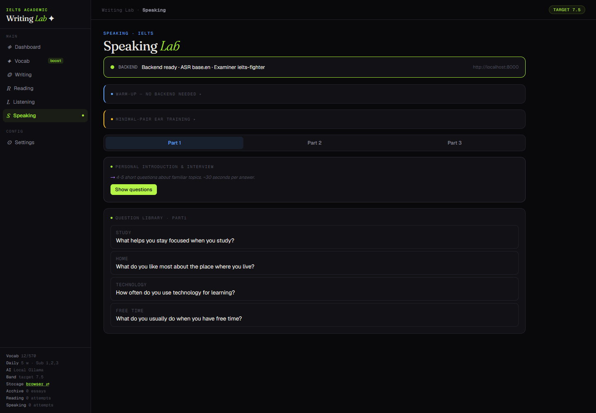

### Vocabulary

Study the 570-word Academic Word List with spaced repetition, definitions, examples, word families, fill-in-the-blank drills, collocations, imported vocabulary, quizzes, priority-word boosts, and optional AI enrichment.

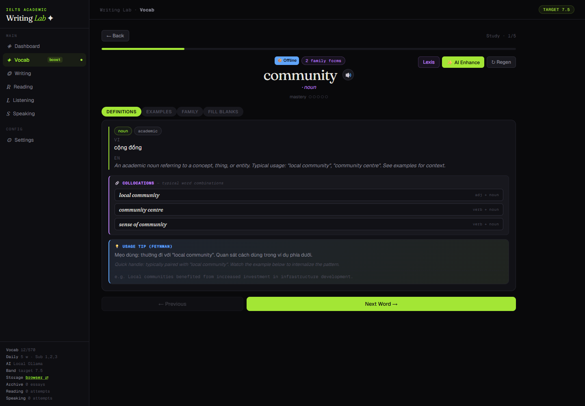

### Dashboard and Study Planning

The dashboard combines next-step recommendations, study planning, reminders, vocabulary targets, learning streaks, real daily activity, score history, revision queues, and weakness tracking.

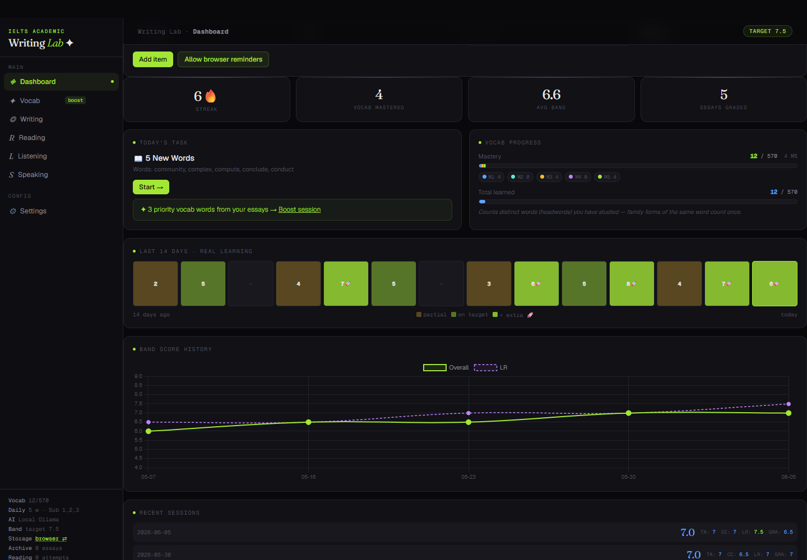

### Settings and Local AI

Settings control goals, feedback style, design eras, AI providers, failover, local Writing grading, Speaking backend URL, storage, vocabulary schedule, and data import/export.

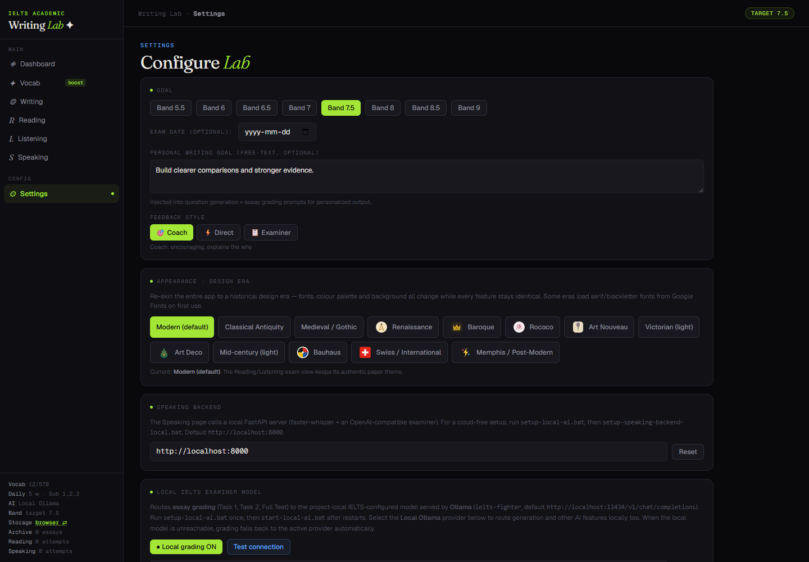

## Capabilities

| Area | Included |
|---|---|
| Writing | Task 1 and Task 2 practice, full tests, four-criterion grading, examples, feedback, rewrite trainer, calibration, archive |
| Reading | Generation pipeline, demo section, complete-test upload, dataset, strategies, theory, exam interface, analytics |
| Listening | Generation, import, transcript practice, library, archive, optional local TTS |
| Speaking | Offline practice, question library, local ASR, examiner scoring, feedback history |
| Vocabulary | AWL schedule, study cards, quizzes, word forms, collocations, imports, priority boosts |
| Dashboard | Study plan, reminders, activity heatmap, score history, weakness and revision tracking |
| AI | Local Ollama, cloud providers, custom OpenAI-compatible endpoints, optional provider failover |
| Storage | Browser localStorage, optional folder-backed state, export and import |

## Choose a Running Mode

| Mode | Start | Best for | Limits |
|---|---|---|---|
| Direct-open | Double-click `index.html` | Fastest start and normal browser practice | Browser storage only; browser CORS may restrict some imports/providers |
| Local app server | `node scripts/serve.mjs` | Recommended daily use | Requires Node.js; opens at `http://localhost:5173` |
| Project-local AI | `start-local-ai.bat` | AI use without a cloud API key | Windows setup; requires several GB of disk and enough RAM/VRAM |
| Speaking backend | `start-speaking-backend.bat` | Scored Speaking and optional Listening TTS | Requires Python environment and `ffmpeg` for browser audio |

The modes can be combined. A complete local setup runs the app server, project-local AI, and Speaking backend together.

## Quick Start

### Basic browser mode

1. Clone or download the repository.
2. Double-click `index.html`.
3. Open **Settings** and add an AI provider, or use non-AI practice features.
4. Export backups periodically from **Settings > Data Management**.

### Recommended local server mode

Install a recent Node.js release, then run:

```powershell
node scripts/serve.mjs
```

Open `http://localhost:5173`.

The local server enables:

- folder-backed study-state storage;
- a local AI proxy for providers that cannot be called directly by the browser;
- stronger URL and document import routes;
- the **Storage: browser <-> folder** control.

No `npm install` is required for the browser application.

## Project-Local AI on Windows

The repository does not include multi-GB runtime or model files. The tracked setup script creates a portable Ollama runtime and model store under the ignored `.local/` directory.

Run once:

```powershell
.\setup-local-ai.bat
```

The setup:

1. copies an existing Ollama runtime when available, or downloads the official standalone runtime;
2. stores the runtime and models inside the project;
3. downloads the default `qwen2.5:7b` base model;
4. creates the app model alias `ielts-fighter`.

Start or stop it with:

```powershell
.\start-local-ai.bat
.\stop-local-ai.bat
```

The local API runs at `http://localhost:11434`.

In **Settings**:

- local Writing grading uses `ielts-fighter` when enabled;
- selecting **Local Ollama** routes other AI tasks through the same local model;
- cloud providers can remain configured as fallbacks.

Uninstalling system-wide Ollama does not affect the project-local copy. If another Ollama process owns port `11434`, quit it before running `start-local-ai.bat`.

### Use another base model

```powershell
.\scripts\setup-local-ai.ps1 -BaseModel "your-model:tag"
```

Local model quality and hardware requirements vary. Stronger cloud models may still be more reliable for complex Reading generation and structured grading.

## Speaking Backend

The optional FastAPI backend provides:

- local speech-to-text through `faster-whisper`;
- acoustic feature extraction;
- examiner feedback from any OpenAI-compatible model;
- local SQLite attempt storage;
- optional local Listening TTS.

### Local examiner without a cloud API key

```powershell
.\setup-local-ai.bat
.\setup-speaking-backend-local.bat
.\start-speaking-backend.bat
```

The first scored attempt downloads the selected Whisper model if it is not already cached.

### Cloud examiner

```powershell
cd speaking-backend
python -m venv .venv
.\.venv\Scripts\python.exe -m pip install -r requirements.txt
copy .env.example .env
```

Edit `speaking-backend/.env`, configure an OpenAI-compatible examiner, then run from the project root:

```powershell
.\start-speaking-backend.bat
```

Install `ffmpeg` so browser-recorded audio can be decoded:

```powershell
winget install Gyan.FFmpeg
```

See [speaking-backend/README.md](speaking-backend/README.md) for backend details.

## Document Import

The local app server can use an in-project MarkItDown environment to convert supported PDFs, Word files, slides, spreadsheets, HTML, CSV, and other documents:

```powershell
node scripts/setup-markitdown.mjs
node scripts/serve.mjs
```

The generated `markitdown-venv/` directory is ignored by Git. Recreate it after moving the project instead of copying the virtual environment.

Very large Reading uploads still depend on the selected AI provider's context and output limits.

## AI Providers

Settings supports:

- project-local Ollama;
- Gemini;
- OpenAI-compatible APIs such as Groq, OpenRouter, DeepSeek, Kimi, Together, NVIDIA, Mistral, and OpenAI;
- Anthropic-compatible requests;
- custom provider URLs and models;
- optional provider failover.

Provider availability, pricing, model names, quotas, and regional access change over time. Verify current provider terms before relying on a specific service.

API keys are stored in browser `localStorage`, not in `data/app-state.json`. Cloud-provider requests leave your machine and are subject to that provider's privacy policy. Use Local Ollama when the AI request itself must remain local.

## Data and Privacy

The project has no account system, analytics service, or hosted application backend.

| Location | Contents | Git behavior |
|---|---|---|
| Browser key `ielts_writing_lab_v1` | Study progress, essays, tests, datasets, and drafts | Not part of the project folder |
| Browser key `ielts_lab_configs` | AI provider configurations, including API keys | Not part of the project folder |
| `data/app-state.json` | Optional folder-backed study-state mirror | Ignored by Git |
| `speaking-backend/data/` | Local Speaking SQLite data | Ignored by Git |
| `.local/` | Project-local Ollama runtime, models, PID, logs, and local tooling | Ignored by Git |
| `markitdown-venv/` | Document-conversion Python environment | Ignored by Git |

Important boundaries:

- cloud AI, Wikipedia grounding, URL import, and other requested network features send requests outside the machine;
- imported exam material, essays, transcripts, and generated datasets may contain private or copyrighted content;
- do not commit personal data, `.env` files, model blobs, databases, runtime folders, or API keys.

## Development

```powershell
# Rebuild dist/app.jsx and the direct-open index.html after editing src/
node scripts/build.mjs

# Run the local application server
node scripts/serve.mjs

# Create the optional document-import environment
node scripts/setup-markitdown.mjs

# Validate local-AI setup paths without downloading or starting anything
.\scripts\setup-local-ai.ps1 -DryRun
```

Edit source files under `src/`. `dist/app.jsx` and `index.html` are generated by `scripts/build.mjs`.

### Project structure

```text
.
|-- src/                    Browser application source
|-- dist/                   Generated application bundle
|-- scripts/                Build, server, import, and local-AI scripts
|-- speaking-backend/       Optional FastAPI Speaking service
|-- local-ai/               Tracked Ollama Modelfile template
|-- vendor/                 Browser runtime dependencies
|-- screenshots/            Public feature screenshots
|-- data/                   Optional local study-state file
|-- index.html              Direct-open generated application
`-- styles.css              Application styles
```

## Before Publishing

Confirm these local or private artifacts are not included:

- `data/app-state.json` and backups;
- `speaking-backend/.env`;
- `speaking-backend/data/`;
- `speaking-backend/audio_cache/`;
- `.local/`;
- `.claude/`;
- `markitdown-venv/`;
- `Conversation.txt`;
- browser-exported study backups.

Runtime and model files must not be committed. Users should run `setup-local-ai.bat` after cloning.

## Troubleshooting

### Local AI will not start

- Quit another Ollama process if it owns port `11434`.
- Run `setup-local-ai.bat` once.
- Check `.local/ollama/logs/ollama.err.log`.
- Use **Test connection** under **Local IELTS examiner model** in Settings.

### Local AI grades Writing but does not generate content

Writing local grading and the active general AI provider are separate settings. Select **Local Ollama** as the active provider for generation and other AI tasks.

### Folder storage or document import is unavailable

Run `node scripts/serve.mjs` and open `http://localhost:5173` instead of double-clicking `index.html`.

### Speaking scoring is unavailable

- Run `start-speaking-backend.bat`.
- Confirm `http://localhost:8000/api/health` responds.
- Install `ffmpeg`.
- Check `speaking-backend/.env` and the backend terminal output.

## Limitations

- AI feedback supports practice and trend tracking; it is not an official IELTS score.
- Generated and AI-extracted questions still require human judgment.
- Local model quality depends on the selected model and available hardware.
- The app is desktop-first and single-user; it does not provide account-based sync.
- Cloud features may incur costs and are subject to provider limits.
- You are responsible for the rights to imported or redistributed study material.

## License

The source code and project documentation are licensed under the [MIT License](LICENSE).

The license does not grant redistribution rights for third-party audio, transcripts, imported passages, copied exam material, personal datasets, user exports, API keys, or files saved under local data directories.
